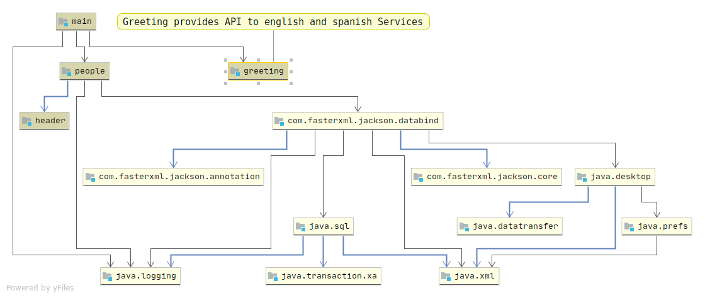

# java-11-upgrade-certification-practice

Sample code to practice for the 1Z0-817 exam

## Build custom runtime image with jlink

Build: `jlink --module-path people/target/people-0.0.1-SNAPSHOT.jar:conversation/target/conversation-0.0.1-SNAPSHOT.jar:greeting/target/greeting-0.0.1-SNAPSHOT.jar:$JAVA_HOME/jmods --add-modules greeting --output myimage`

Optimize image: `jlink --module-path people/target/people-0.0.1-SNAPSHOT.jar:conversation/target/conversation-0.0.1-SNAPSHOT.jar:greeting/target/greeting-0.0.1-SNAPSHOT.jar:$JAVA_HOME/jmods --add-modules greeting --strip-debug --compress=2 --output myimagecompress` 

Run: `myimage/bin/java -m greeting/com.main.Main`

## Migration with jdeps

Show dependencies: ` jdeps -R -summary --module-path conversation/target/conversation-0.0.1-SNAPSHOT.jar:people/target/people-0.0.1-SNAPSHOT.jar greeting/target/greeting-0.0.1-SNAPSHOT.jar`

Generate `module-info.java`: `jdeps --generate-module-info module-info-files lib/* dist/*`

Strategies:

1.- Break cyclic dependencies and split packages with refactor and new modules. 
2.- Top-down migration (Migrate application first, libraries latter)
3.- Bottom-up migration (Library first, application latter)

# MRJAR

See config in people module's pom.xml.

# Inheritance rules of `default` methods

1. A superclass method takes priority over an interface default method.
2. A subtype interface's default method takes priority over a supertype interface's default method.
3. If there a conflict, treat the default method as abstract. 

# Compilation

`mvn clean package` -> Require Java 12 onwards. 

# Main module execution

`java -jar -p people/target/people-0.0.1-SNAPSHOT.jar:main/target/main-0.0.1-SNAPSHOT.jar:header/target/header-0.0.1-SNAPSHOT.jar:greeting/target/greeting-0.0.1-SNAPSHOT.jar:spanish/target/spanish-0.0.1-SNAPSHOT.jar:$HOME/.m2/repository/com/fasterxml/jackson/core/jackson-databind/2.10.2/jackson-databind-2.10.2.jar:$HOME/.m2/repository/com/fasterxml/jackson/core/jackson-annotations/2.10.2/jackson-annotations-2.10.2.jar:$HOME/.m2/repository/com/fasterxml/jackson/core/jackson-core/2.10.2/jackson-core-2.10.2.jar -m main/com.main.Main`

# Main module diagram

